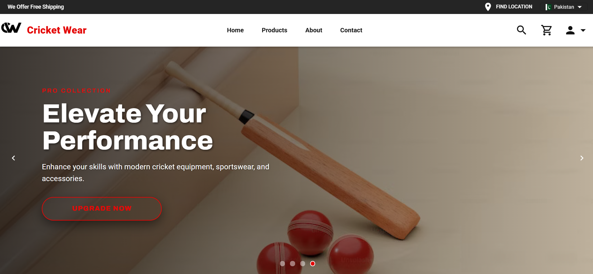
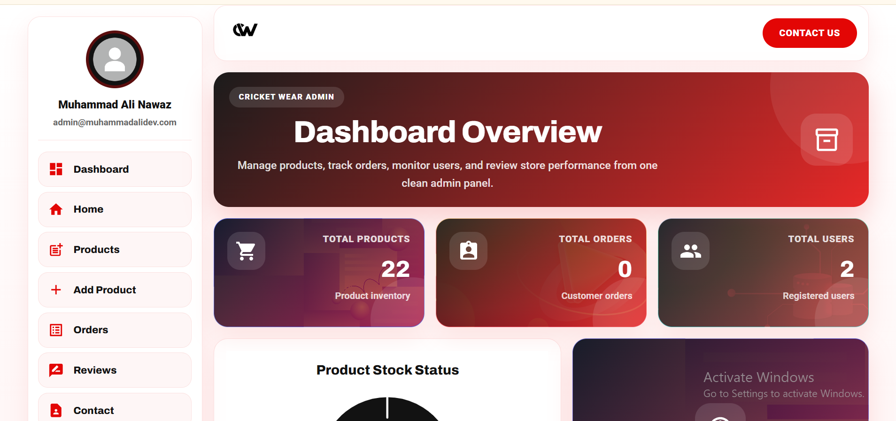
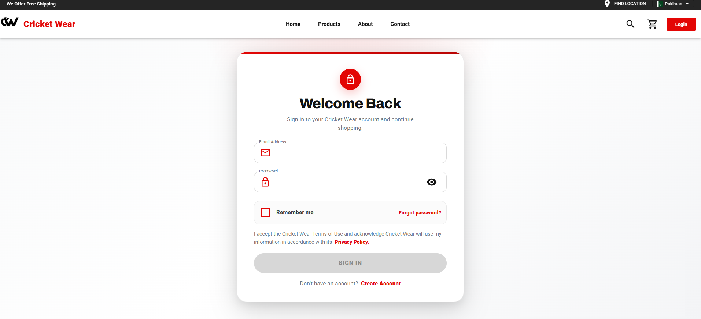
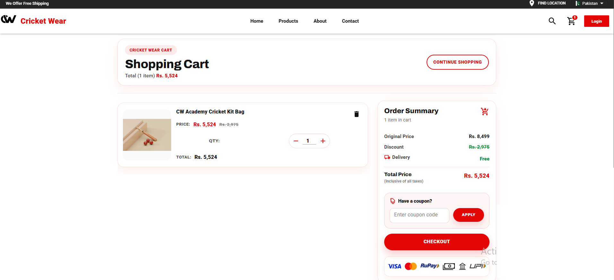
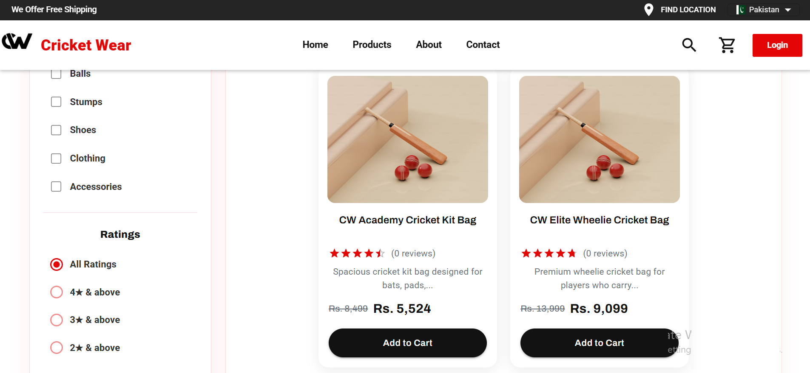
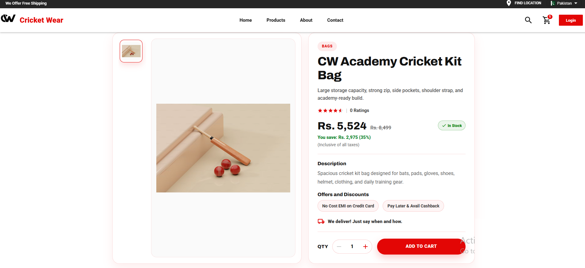

<div align="center">

# 🏏 Cricket Wear — E-Commerce Store

A modern full-stack **Cricket E-Commerce Platform** built with **React, Vite, Redux, Material UI, Node.js, Express.js, MongoDB, Mongoose, JWT Authentication, Stripe, Cloudinary, and Nodemailer**.  
Cricket Wear helps customers browse cricket products, manage cart and checkout, place orders, write reviews, and allows admins to manage products, orders, users, reviews, and dashboard analytics from a polished responsive admin panel.


</div>

---

## 📌 Project Overview

**Cricket Wear** is a full-stack MERN e-commerce application focused on cricket products such as bats, balls, batting gloves, pads, helmets, bags, shoes, clothing, kits, and accessories.

The platform includes a customer-facing store and a role-based admin dashboard. Customers can browse products, search/filter items, add products to cart, checkout, place orders, view order history, and manage their profile. Admin users can manage products, orders, users, reviews, and view store dashboard analytics.

---

## ✨ Premium Features

- 🔐 **JWT authentication** with protected private routes
- 👥 **Role-based access control** for user and admin accounts
- 🛒 **Shopping cart** with quantity management and local persistence
- 🏏 **Cricket product catalog** with product detail pages
- 🔎 **Product search, filtering, sorting, and pagination**
- ⭐ **Product reviews and recommendations**
- 💳 **Stripe payment flow** for checkout
- 📦 **Customer order placement and order history**
- 🧾 **Admin order management** with order status processing
- 🛍️ **Admin product CRUD** with image upload support
- ☁️ **Cloudinary image upload support** with local fallback images
- 👤 **User profile management**
- 🔑 **Forgot/reset password flow** with email support
- 📊 **Admin dashboard analytics** using Highcharts
- 🧑‍💼 **Admin user management**
- 📝 **Admin review management**
- 📱 **Responsive customer and admin UI**
- 🖼️ **Seed images and demo data** for quick local testing
- 🩺 **Health/status API endpoints** for backend checks
- 🚀 **Vercel configuration** included for deployment experiments

---

## 🖼️ Screenshots

| Home Page | Admin Dashboard |
|-----------|-------------|
|  |  |

| Login | Cart |
|-----------|-------------|
|  |  |

| Products | Product DetailsCart |
|-----------|-------------|
|  |  |


---

## 🧰 Tech Stack

### Frontend

- React 18
- Vite
- React Router DOM v5
- Redux
- Redux Thunk
- Axios
- Material UI
- MUI Icons
- MUI DataGrid
- Highcharts
- Framer Motion
- Swiper
- React Helmet
- Styled Components
- CSS

### Backend

- Node.js
- Express.js
- MongoDB
- Mongoose
- JWT Authentication
- bcryptjs
- Cookie Parser
- CORS
- Helmet
- express-fileupload
- Cloudinary
- Stripe
- Nodemailer
- dotenv

### Database

- MongoDB Atlas or local MongoDB
- Mongoose schemas and models
- Seed data for demo users and cricket products

### Dev / Deployment

- Vite frontend build
- Express REST API
- Concurrent development scripts
- Vercel config
- Health check routes
- Static frontend serving through Express in production

---

## 👤 User Roles & Flow

| Role | Description |
| --- | --- |
| **Customer/User** | Browses products, adds to cart, checks out, places orders, manages profile, and reviews products |
| **Admin** | Manages dashboard, products, orders, users, reviews, and order processing |

### Main Customer Workflow

1. Customer browses cricket products from the store.
2. Customer opens product details and adds items to cart.
3. Customer enters shipping information.
4. Customer confirms order and proceeds to payment.
5. Customer views placed orders from the account area.
6. Customer can review purchased products.

### Main Admin Workflow

1. Admin logs into the dashboard.
2. Admin creates, updates, and deletes products.
3. Admin views all orders and processes order status.
4. Admin manages users and roles.
5. Admin checks product reviews and deletes inappropriate reviews.
6. Admin monitors dashboard analytics and store statistics.

---

## 📁 Folder Structure

```bash
CricketWear/
├── backend/
│   ├── config/
│   │   ├── config.env.example
│   │   └── config.env              # local only, do not commit
│   ├── controller/
│   │   ├── orderController.js
│   │   ├── paymentController.js
│   │   ├── productController.js
│   │   └── userConttroler.js
│   ├── data/
│   │   └── seedData.js
│   ├── db/
│   │   └── connectDB.js
│   ├── middleWare/
│   │   ├── auth.js
│   │   ├── error.js
│   │   └── requestLogger.js
│   ├── model/
│   │   ├── orderModel.js
│   │   ├── ProductModel.js
│   │   └── userModel.js
│   ├── route/
│   │   ├── healthRoute.js
│   │   ├── orderRoute.js
│   │   ├── paymentRoute.js
│   │   ├── productRoute.js
│   │   └── userRoute.js
│   ├── seeder/
│   │   ├── productsOnlySeed.js
│   │   └── seed.js
│   ├── utils/
│   │   ├── apiFeatures.js
│   │   ├── errorHandler.js
│   │   ├── JwtToken.js
│   │   └── sendEmail.js
│   ├── app.js
│   └── server.js
├── frontend/
│   ├── public/
│   │   └── seed-images/
│   ├── src/
│   │   ├── actions/
│   │   ├── component/
│   │   │   ├── Admin/
│   │   │   ├── Cart/
│   │   │   ├── Home/
│   │   │   ├── layouts/
│   │   │   ├── order/
│   │   │   ├── Product/
│   │   │   ├── Route/
│   │   │   └── User/
│   │   ├── constants/
│   │   ├── reducers/
│   │   ├── Terms&Condtions/
│   │   ├── App.jsx
│   │   ├── main.jsx
│   │   └── store.jsx
│   ├── package.json
│   └── vite.config.js
├── docs/
│   └── screenshots/
├── .gitignore
├── LICENSE
├── package.json
├── README.md
└── vercel.json
```

---

## ⚙️ Environment Variables

Create this file:

```bash
backend/config/config.env
```

You can copy from:

```bash
backend/config/config.env.example
```

Example local configuration:

```env
# Database
MONGO_URI=mongodb://localhost:27017/cricket-wear-store
# DB_LINK=mongodb://localhost:27017/cricket-wear-store

# JWT
JWT_SECRET=replace_with_a_strong_secret_key
JWT_EXPIRE=7d
COOKIE_EXPIRE=7

# Server
PORT=5000
NODE_ENV=development
FRONTEND_URL=http://localhost:3000
LOG_REQUESTS=false

# Cloudinary - optional for local development
CLOUDINARY_NAME=
API_KEY=
API_SECRET=

# Stripe - optional until payment is enabled
STRIPE_SECRET_KEY=
STRIPE_API_KEY=

# Email - optional until forgot-password email is enabled
SMTP_HOST=smtp.gmail.com
SMTP_PORT=587
SMTP_SERVICE=gmail
SMTP_MAIL=
SMTP_PASSWORD=
```

| Variable | Description |
| --- | --- |
| `MONGO_URI` | MongoDB Atlas or local MongoDB connection string |
| `DB_LINK` | Alternative MongoDB connection variable supported by the project |
| `JWT_SECRET` | Secret key used for JWT token signing |
| `JWT_EXPIRE` | JWT token expiry time |
| `COOKIE_EXPIRE` | Cookie expiry in days |
| `PORT` | Backend server port, default `5000` |
| `NODE_ENV` | App environment, usually `development` or `production` |
| `FRONTEND_URL` | Frontend URL for CORS |
| `LOG_REQUESTS` | Enables optional backend request logging |
| `CLOUDINARY_NAME` | Cloudinary cloud name for product/user images |
| `API_KEY` | Cloudinary API key |
| `API_SECRET` | Cloudinary API secret |
| `STRIPE_SECRET_KEY` | Stripe secret key for payment processing |
| `STRIPE_API_KEY` | Stripe publishable key exposed to frontend |
| `SMTP_*` | Email configuration for forgot/reset password flow |

> Never commit real secrets. Keep `backend/config/config.env` local only.

---

## 🛢️ MongoDB Setup

### Option 1: Local MongoDB

Install MongoDB locally and use:

```env
MONGO_URI=mongodb://localhost:27017/cricket-wear-store
```

### Option 2: MongoDB Atlas

Create a MongoDB Atlas cluster and use:

```env
MONGO_URI=mongodb+srv://<username>:<password>@<cluster-url>/cricket-wear-store
```

Make sure your IP address is allowed in MongoDB Atlas Network Access.

---

## 🚀 Getting Started

### 1. Clone the repository

```bash
git clone https://github.com/your-username/cricket-wear-mern-ecommerce.git
cd cricket-wear-mern-ecommerce
```

If you already downloaded the ZIP:

```bat
cd C:\Users\Work\Desktop\cricket-wear-mern-ecommerce
```

### 2. Install root/backend dependencies

```bat
npm install
```

### 3. Install frontend dependencies

```bat
cd frontend
npm install
cd ..
```

### 4. Configure environment variables

Create the backend environment file:

```bat
copy backend\config\config.env.example backend\config\config.env
```

Then edit:

```bat
notepad backend\config\config.env
```

Add your MongoDB URI and optional Stripe, Cloudinary, and email values.

### 5. Seed demo data

From the project root:

```bat
npm run seed
```

To remove seeded demo data:

```bat
npm run seed:destroy
```

### 6. Start backend and frontend together

```bat
npm run dev
```

Backend runs at:

```bash
http://localhost:5000
```

Frontend runs at:

```bash
http://localhost:3000
```

---

## ▶️ Manual Run Commands

### Backend only

From the project root:

```bat
npm run dev:server
```

or:

```bat
npm start
```

### Frontend only

```bat
cd frontend
npm run dev
```

### Frontend production build

```bat
cd frontend
npm run build
npm start
```

### Clean frontend install on Windows

Use this if Vite/native dependency errors appear:

```bat
cd frontend
rmdir /s /q node_modules
del package-lock.json
npm install
npm run build
npm start
```

---

## 🔐 Demo Login Credentials

After running the seed command:

### Admin

```bash
Email: admin@muhammadalidev.com
Password: Admin@12345
Role: admin
```

### Customer/User

```bash
Email: user@muhammadalidev.com
Password: User@12345
Role: user
```

---

## 📜 Available Scripts

Run these from the project root:

| Command | Description |
| --- | --- |
| `npm start` | Start the Express backend server |
| `npm run server` | Start the Express backend server |
| `npm run dev:server` | Start backend with Nodemon |
| `npm run dev:client` | Start Vite frontend on port `3000` |
| `npm run dev` | Start backend and frontend together with concurrently |
| `npm run build:client` | Build frontend production files |
| `npm run seed` | Seed demo users and products |
| `npm run seed:destroy` | Remove seeded demo users and products |

Run these from the `frontend` folder:

| Command | Description |
| --- | --- |
| `npm run dev` | Start Vite development server |
| `npm run build` | Create frontend production build |
| `npm start` | Preview production build on port `3000` |
| `npm run preview` | Preview production build |

---

## 🔗 Main App Routes

| Module | Route | Description |
| --- | --- | --- |
| Home | `/` | Public landing/home page |
| Products | `/products` | Product listing page |
| Product Search | `/products/:keyword` | Product search result page |
| Product Details | `/product/:id` | Single product details page |
| Cart | `/cart` | Shopping cart page |
| Login | `/login` | User login page |
| Signup | `/signup` | User registration page |
| Forgot Password | `/password/forgot` | Password recovery page |
| Reset Password | `/password/reset/:token` | Password reset page |
| Account | `/account` | Authenticated user profile |
| Update Profile | `/profile/update` | Update user profile |
| Update Password | `/password/update` | Update password |
| My Orders | `/orders` | Customer order history |
| Shipping | `/shipping` | Checkout shipping form |
| Confirm Order | `/order/confirm` | Checkout confirmation |
| Payment | `/process/payment` | Stripe payment page |
| Success | `/success` | Order success page |
| About | `/about_us` | About page |
| Contact | `/contact` | Contact page |
| Return Policy | `/policy/return` | Return policy page |
| Terms of Use | `/policy/Terms` | Terms of use page |
| Privacy Policy | `/policy/privacy` | Privacy policy page |

---

## 🛠️ Admin Routes

| Module | Route | Description |
| --- | --- | --- |
| Admin Dashboard | `/admin/dashboard` | Admin analytics dashboard |
| Products | `/admin/products` | Admin product list |
| Add Product | `/admin/new/product` | Create new product |
| Update Product | `/admin/product/:id` | Edit product |
| Orders | `/admin/orders` | Admin order list |
| Process Order | `/admin/order/:id` | Update order status |
| Reviews | `/admin/reviews` | Product review management |
| Users | `/admin/users` | User management |
| Update User | `/admin/user/:id` | Update user role |

---

## 🔌 API Modules

All backend API routes are prefixed with:

```bash
/api/v1
```

| Module | Base Route | Description |
| --- | --- | --- |
| Products | `/api/v1/product` | Public product listing |
| Product Details | `/api/v1/product/:id` | Single product details |
| Admin Products | `/api/v1/admin/products` | Admin product listing |
| New Product | `/api/v1/admin/product/new` | Admin create product |
| Update/Delete Product | `/api/v1/admin/product/:id` | Admin product update/delete |
| Reviews | `/api/v1/reviews` | Get reviews for a product |
| New Review | `/api/v1/review/new` | Create/update product review |
| Delete Review | `/api/v1/product/reviews/delete` | Admin delete review |
| Register | `/api/v1/register` | Create user account |
| Login | `/api/v1/login` | Login user |
| Logout | `/api/v1/logout` | Logout user |
| Profile | `/api/v1/profile` | Current user profile |
| Password Update | `/api/v1/password/update` | Update password |
| Profile Update | `/api/v1/profile/update` | Update profile |
| Forgot Password | `/api/v1/password/forgot` | Send reset password email |
| Reset Password | `/api/v1/password/reset/:token` | Reset password |
| Admin Users | `/api/v1/admin/users` | Admin user list |
| Admin User | `/api/v1/admin/user/:id` | Admin user view/update/delete |
| New Order | `/api/v1/order/new` | Create new order |
| My Orders | `/api/v1/orders/myOrders` | Current user's orders |
| Single Order | `/api/v1/order/:id` | Single order details |
| Admin Orders | `/api/v1/admin/orders` | Admin order list |
| Admin Order | `/api/v1/admin/order/:id` | Admin update/delete order |
| Payment | `/api/v1/payment/process` | Stripe payment processing |
| Stripe Key | `/api/v1/stripeapikey` | Get Stripe publishable key |
| Health | `/api/v1/health` | Server health check |
| Status | `/api/v1/status` | Server status and feature flags |

---

## 🧑‍💻 Author

**Muhammad Ali Nawaz**  
MERN Stack Developer  

---

## 📄 License

This project is licensed under the [MIT License](LICENSE).

---

<p align="center">
  <b>⭐ If you like this project, consider starring the repository!</b>
</p>
